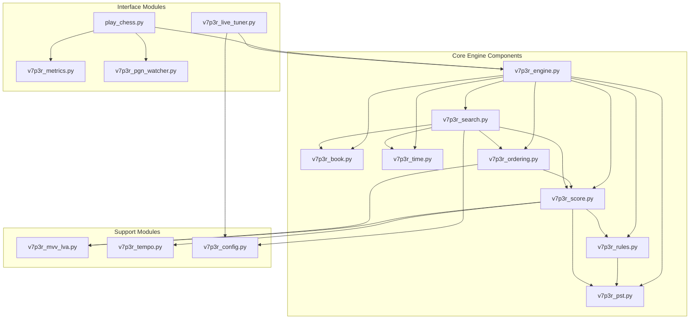

# V7P3R Engine Module Dependencies

## Module Responsibilities

### Core Engine Components
- `v7p3r_engine.py`: Main engine class and component orchestration
- `v7p3r_pst.py`: Piece-square table management
- `v7p3r_book.py`: Opening book handling
- `v7p3r_time.py`: Time management
- `v7p3r_rules.py`: Game rules and validation
- `v7p3r_score.py`: Position evaluation
- `v7p3r_ordering.py`: Move ordering
- `v7p3r_search.py`: Search algorithms

### Support Modules
- `v7p3r_mvv_lva.py`: MVV-LVA calculations
- `v7p3r_tempo.py`: Tempo assessment
- `v7p3r_config.py`: Configuration management

### Interface Modules
- `play_chess.py`: Game play interface
- `v7p3r_metrics.py`: Performance metrics
- `v7p3r_pgn_watcher.py`: PGN file monitoring
- `v7p3r_live_tuner.py`: Real-time engine tuning

## Current Issues

1. Circular Dependencies
   - Potential cycle between score/ordering/search modules
   - Config dependencies need consolidation

2. Import Management
   - Redundant sys.path modifications
   - Inconsistent import patterns
   - Duplicate utility imports

3. Component Initialization
   - Complex dependency chain in engine.py
   - Mixed initialization order

4. Type Safety
   - Incomplete type hints
   - Missing return type annotations

## Proposed Solutions

1. Dependency Resolution
   - Extract shared interfaces
   - Create proper abstraction layers
   - Implement dependency injection

2. Import Cleanup
   - Centralize path management
   - Standardize import patterns
   - Remove redundant imports

3. Initialization Refinement
   - Implement builder pattern
   - Clear dependency order
   - Proper error handling

4. Type System Enhancement
   - Add complete type coverage
   - Create type aliases
   - Document interfaces
