# V7P3R Chess Engine Workflow Diagram

This diagram shows the complete search workflow from UCI position input to best move selection.

## Complete Search Flow

```mermaid
flowchart TD
    Start([UCI: position + go command]) --> TimeCalc[TimeManager: calculate_time_allocation]
    TimeCalc --> |target_time, max_time| SearchEntry[Engine.search - ROOT LEVEL]
    
    SearchEntry --> InitStats[Initialize: nodes=0, start_time]
    InitStats --> GenLegal[Generate legal_moves]
    GenLegal --> CheckEmpty{legal_moves empty?}
    CheckEmpty -->|Yes| ReturnNull([Return null move])
    CheckEmpty -->|No| CheckBook{Position in opening_book?}
    
    CheckBook -->|Yes| BookMove([Return weighted book move])
    CheckBook -->|No| MateFastPath[Mate-in-1 Fast Path]
    
    MateFastPath --> CheckMate{Any move gives checkmate?}
    CheckMate -->|Yes| ReturnMate([Return checkmate move])
    CheckMate -->|No| IterDepth[Iterative Deepening Loop: depth 1..10]
    
    IterDepth --> CheckTime1{elapsed >= target_time?}
    CheckTime1 -->|Yes| ReturnBest([Return best_move from last completed depth])
    CheckTime1 -->|No| PredictTime{depth > 1: Can complete next iteration?}
    
    PredictTime -->|No, would timeout| ReturnBest
    PredictTime -->|Yes| AspirationWindow{depth >= 3?}
    
    AspirationWindow -->|Yes| NarrowSearch[Aspiration window: alpha=score-50, beta=score+50]
    AspirationWindow -->|No| FullSearch[Full window: alpha=-99999, beta=99999]
    
    NarrowSearch --> RecursiveCall[Call _recursive_search depth, alpha, beta]
    FullSearch --> RecursiveCall
    
    RecursiveCall --> RecursiveEntry[**_recursive_search - RECURSIVE LEVEL**]
    
    %% Recursive Search Flow
    RecursiveEntry --> IncrNodes[nodes_searched++]
    IncrNodes --> TimeCheck{nodes % 1000 == 0?}
    TimeCheck -->|Yes| CheckTimeout{elapsed > time_limit?}
    CheckTimeout -->|Yes| EmergencyReturn([Emergency return: evaluate_position])
    CheckTimeout -->|No| TTProbe
    TimeCheck -->|No| TTProbe
    
    TTProbe[1. Transposition Table Probe] --> TTHit{TT hit with valid bounds?}
    TTHit -->|Yes| ReturnTT([Return TT score + move])
    TTHit -->|No| DepthCheck{search_depth == 0?}
    
    DepthCheck -->|Yes| Quiescence[Enter Quiescence Search]
    DepthCheck -->|No| GenMoves[2. Generate legal_moves]
    
    GenMoves --> NoMoves{legal_moves empty?}
    NoMoves -->|Yes| CheckmateCheck{board.is_check?}
    CheckmateCheck -->|Yes| ReturnMateScore([Return -29000 + depth penalty])
    CheckmateCheck -->|No| ReturnStalemate([Return 0.0 stalemate])
    
    NoMoves -->|No| NullMove{3. Null Move Pruning applicable?}
    NullMove -->|Yes: depth>=3, not check, has pieces| DoNullMove[Switch turn, search depth-2]
    DoNullMove --> NullCutoff{null_score >= beta?}
    NullCutoff -->|Yes| ReturnNullScore([Return null_score cutoff])
    NullCutoff -->|No| MoveOrder
    NullMove -->|No| MoveOrder
    
    MoveOrder[4. Move Ordering: _order_moves_advanced] --> OrderSteps
    
    subgraph OrderSteps [Move Ordering Details]
        direction TB
        TTFirst[1. TT move first if available]
        TTFirst --> ScoreMoves[2. Score remaining moves]
        ScoreMoves --> MVVLVACaptures[Captures: MVV-LVA score + 10000]
        MVVLVACaptures --> Checks[Checks: +5000]
        Checks --> Killers[Killer moves: +3000]
        Killers --> History[Quiet moves: history_heuristic score]
        History --> SortMoves[3. Sort by score descending]
    end
    
    MoveOrder --> SearchLoop[5. Main Search Loop: for each ordered_move]
    
    SearchLoop --> MakeMove[board.push move]
    MakeMove --> LMRCheck{Late Move Reduction applicable?}
    
    LMRCheck -->|Yes: moves_searched > threshold| ReducedSearch[Search at depth-1-reduction]
    ReducedSearch --> FailHigh{score > alpha?}
    FailHigh -->|Yes| ReSearch[Re-search at full depth-1]
    FailHigh -->|No| UnmakeMove
    
    LMRCheck -->|No| FullDepthSearch[Search at full depth-1]
    ReSearch --> RecursiveCall
    FullDepthSearch --> RecursiveCall
    
    RecursiveCall -.->|Recursive call| RecursiveEntry
    
    UnmakeMove[board.pop move] --> UpdateBest{score > best_score?}
    UpdateBest -->|Yes| NewBest[best_move = move, best_score = score]
    UpdateBest -->|No| UpdateAlpha
    
    NewBest --> UpdateAlpha{score > alpha?}
    UpdateAlpha -->|Yes| SetAlpha[alpha = score]
    SetAlpha --> BetaCutoff
    UpdateAlpha -->|No| BetaCutoff
    
    BetaCutoff{alpha >= beta?}
    BetaCutoff -->|Yes| UpdateHeuristics[Update killer_moves & history_heuristic]
    UpdateHeuristics --> TTStore
    BetaCutoff -->|No| MoreMoves{More moves?}
    MoreMoves -->|Yes| SearchLoop
    MoreMoves -->|No| TTStore
    
    TTStore[6. Store in Transposition Table] --> ReturnScore([Return best_score, best_move])
    
    %% Quiescence Search Subgraph
    Quiescence --> QNodes[nodes_searched++]
    QNodes --> StandPat[Evaluate stand_pat = _evaluate_position]
    StandPat --> QBeta{stand_pat >= beta?}
    QBeta -->|Yes| ReturnBeta([Return beta])
    QBeta -->|No| QAlpha{stand_pat > alpha?}
    QAlpha -->|Yes| UpdateQAlpha[alpha = stand_pat]
    QAlpha -->|No| QDepth
    UpdateQAlpha --> QDepth{q_depth <= 0?}
    QDepth -->|Yes| ReturnStandPat([Return stand_pat])
    QDepth -->|No| GenTactical[Generate captures + checks only]
    GenTactical --> NoTactical{tactical_moves empty?}
    NoTactical -->|Yes| ReturnStandPat
    NoTactical -->|No| SortTactical[Sort by MVV-LVA]
    SortTactical --> QLoop[For each tactical move]
    QLoop --> QMake[board.push move]
    QMake --> QRecurse[Recursive quiescence_search]
    QRecurse -.->|Recursive call| Quiescence
    QRecurse --> QUnmake[board.pop move]
    QUnmake --> QUpdate{score > best_score?}
    QUpdate -->|Yes| QBest[Update best_score, alpha]
    QUpdate -->|No| QCutoff
    QBest --> QCutoff{alpha >= beta?}
    QCutoff -->|Yes| ReturnQScore([Return alpha])
    QCutoff -->|No| QMore{More tactical moves?}
    QMore -->|Yes| QLoop
    QMore -->|No| ReturnQScore
    
    %% Return to iterative deepening
    ReturnScore -.->|Return to root| CheckThreefold
    CheckThreefold{Threefold repetition check}
    CheckThreefold -->|Move causes threefold & eval > 50cp| AvoidThreefold[Penalize in TT, re-search for alternative]
    CheckThreefold -->|No threefold OR eval <= 50cp| StoreIteration
    AvoidThreefold --> StoreIteration
    
    StoreIteration[Store iteration results, update PV] --> PrintInfo[Print UCI info: depth, score, nodes, time, pv]
    PrintInfo --> NextDepth{More depths to search?}
    NextDepth -->|Yes| IterDepth
    NextDepth -->|No| ReturnBest
    
    style RecursiveEntry fill:#ffcccc
    style Quiescence fill:#ccffcc
    style MoveOrder fill:#ccccff
    style OrderSteps fill:#e6e6ff
    style TTProbe fill:#ffffcc
    style TTStore fill:#ffffcc
```

## Performance Hotspots (Identified)

### 🔥 Critical Path Components (Called Every Node)

1. **Node Counter Increment** - O(1) per node
2. **Time Check** - Every 1000 nodes (negligible)
3. **TT Probe** - Hash lookup, O(1) but expensive hash calculation
4. **Move Generation** - `list(board.legal_moves)` - **EXPENSIVE**
5. **Move Ordering** - For loop over all moves - **EXPENSIVE**
6. **Alpha-Beta Loop** - Recursive calls - **CORE ALGORITHM**
7. **Evaluation** - Called at leaf nodes and quiescence - **FREQUENT**

### 🐌 Suspected Bottlenecks (v19.2 still ~9k NPS)

#### Already Fixed ✅
- ~~Move safety checks (0.083ms/move)~~ - Removed in v19.1
- ~~board.is_game_over() at every node~~ - Removed in v19.2

#### Still Suspected 🔍
1. **Move Generation** - `list(board.legal_moves)` called 2x per node (null move + main search)
2. **Move Ordering** - Loop through all ~35 moves scoring each
3. **TT Zobrist Hashing** - Hash calculation might be slow
4. **Quiescence Search** - Depth 4, generates moves, MVV-LVA sorting
5. **board.push/pop** - Python-chess overhead for make/unmake
6. **Evaluation calls** - Even at 0.001ms, called very frequently

### 📊 Estimated Call Frequencies (Depth 4 search, 35 legal moves)

- **Nodes searched**: ~35,000 (35^4 with pruning)
- **TT probes**: 35,000 (every node)
- **Move generation**: 70,000 (every node + null move)
- **Move ordering**: 35,000 (every node)
- **Evaluations**: ~35,000 (quiescence + leaf nodes)
- **Quiescence nodes**: ~100,000+ (depth 4 tactical search)

## Next Profiling Steps

1. **Component timing** - Time each function independently
2. **Call count tracking** - Verify frequency estimates
3. **Python-chess overhead** - Test if library is the bottleneck
4. **Comparison baseline** - Find reference Python engine NPS
